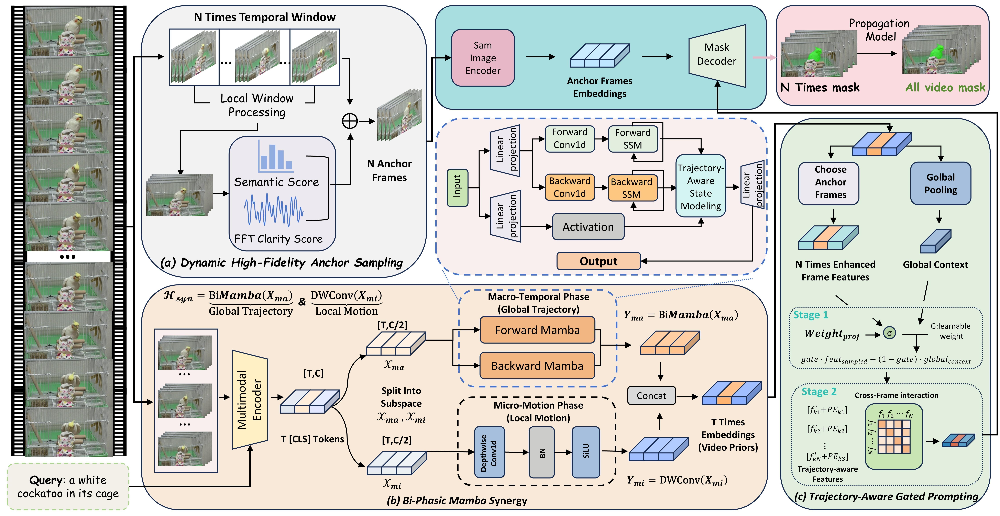
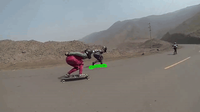
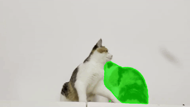

<div align="center">
<h1>
<b>
DAP-Mamba: Dynamic Anchor Prompting <br> with Bi-Phasic Mamba for Referring Video Object Segmentation
</b>
</h1>

<p>
Wei He, Jiaqing Fan<sup>*</sup>, Zhengtong Zhu, Fanzhang Li
</p>
</div>

<p align="center">
  
</p>

## Abstract

Existing two-stage referring video object segmentation (RVOS) methods are prone to semantic hijacking, mainly due to inadequate sampling strategies and isolated feature extraction. As linguistic priors dominate visual evidence, local distractors can override the target identity and cause persistent drift during mask propagation.

To address this, we propose DAP-Mamba (Dynamic Anchor Prompting with Bi-Phasic Mamba), a spatiotemporal synergistic framework for RVOS.

Specifically, we first introduce Dynamic High-Fidelity Anchor Sampling, which adaptively selects reliable anchor frames via macro-temporal windowing and joint multimodal scoring.

Furthermore, we develop a Bi-Phasic Mamba Synergy mechanism for robust spatiotemporal modeling. To prevent feature homogenization in long-sequence modeling, we decouple the feature space into a macro-temporal phase for global trajectory tracking and a micro-motion phase for short-term motion modeling.

Additionally, Trajectory-Aware Gated Prompting is developed to refine anchor features using global video priors and trajectory-aware positional encodings to facilitate cross-frame interaction, producing reliable prompts that reduce semantic ambiguity and mitigate error propagation.

Extensive experiments across five benchmarks demonstrate the effectiveness of DAP-Mamba and the proposed modules, showing strong performance in scenarios with complex motion and multiple similar objects.

## Demo Video

<table>
  <tr>
    <td></td>
    <td></td>
  </tr>
  <tr>
    <td></td>
    <td></td>
  </tr>
</table>

## Highlights

- DAP-Mamba achieves state-of-the-art performance on multiple RVOS benchmarks.
- Dynamic anchor sampling selects clear frames aligned with the language query.
- Bi-phasic Mamba captures global temporal context and preserves local motion details.
- Trajectory-aware gated prompting refines anchor features with global video priors.

## Requirements

The code is designed for a CUDA-enabled PyTorch environment. A typical setup uses:

- Python 3.10+
- PyTorch with CUDA support
- DeepSpeed
- Mamba-related CUDA extensions

Please refer to [install.md](docs/install.md) for installation.

## Data Preparation

Please refer to [data.md](docs/data.md) for dataset preparation.

## Training

Run the Python entry points directly from the repository root.

```bash
# Ref-Youtube-VOS / YTVOS-style training
deepspeed --master_port 29502 --num_gpus 2 train/train_ytvos.py

# MeVIS training
deepspeed --master_port 29502 --num_gpus 2 train/train_mevis.py

# A2D-Sentences training
deepspeed --master_port 29502 --num_gpus 2 train/train_a2d.py
```

Default checkpoint outputs:

```text
weights/checkPoint_full_video_mamba/
weights/mevis/checkPoint_full_mamba/
```

Adjust dataset roots, batch settings, epochs, and checkpoint paths directly in the training scripts if your local layout differs.

## Inference

The `run/` directory keeps one representative inference entry point for each supported benchmark.

```bash
# Ref-Youtube-VOS / YTVOS
python run/run_ytvos.py

# MeVIS
python run/run_mevis2.py

# DAVIS
python run/run_davis.py

# A2D-Sentences
python run/inference_a2d.py \
  --dataset_path ../../dataset/a2d_sentences \
  --output_dir outputs/A2d \
  --method sam2

# JHMDB-Sentences
python run/inference_jhmdb.py \
  --dataset_path ../../dataset/jhmdb_sentences \
  --output_dir outputs/Jhmdb_sam \
  --method sam2
```

The A2D and JHMDB scripts support `--method sam2` and `--method cutie`. The default output folders are under `outputs/`.

## Evaluation

Run the corresponding evaluator after generating masks or COCO-format prediction files.

```bash
# Ref-Youtube-VOS / YTVOS split-mask evaluation
python eval/eval_youtube.py

# DAVIS evaluation
python eval/eval_davis.py --davis_path ../../dataset/davis/DAVIS --set val --task unsupervised

# A2D and JHMDB COCO-style evaluation
python eval/eval.py --dataset both

# MeVIS evaluation
python tools/mevis/eval_mevis.py
```

Before evaluation, check the default prediction paths in each script and update them if your outputs are stored elsewhere.

## Acknowledgement

This repository builds upon the excellent work of [EVF-SAM](https://github.com/hustvl/EVF-SAM), [FindTrack](https://github.com/suhwan-cho/FindTrack), [SAM 2](https://github.com/facebookresearch/sam2), and [Mamba](https://github.com/state-spaces/mamba). Thanks for their inspiring and well-maintained open-source implementations.
